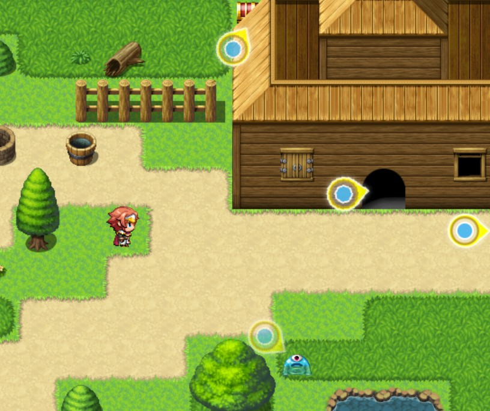
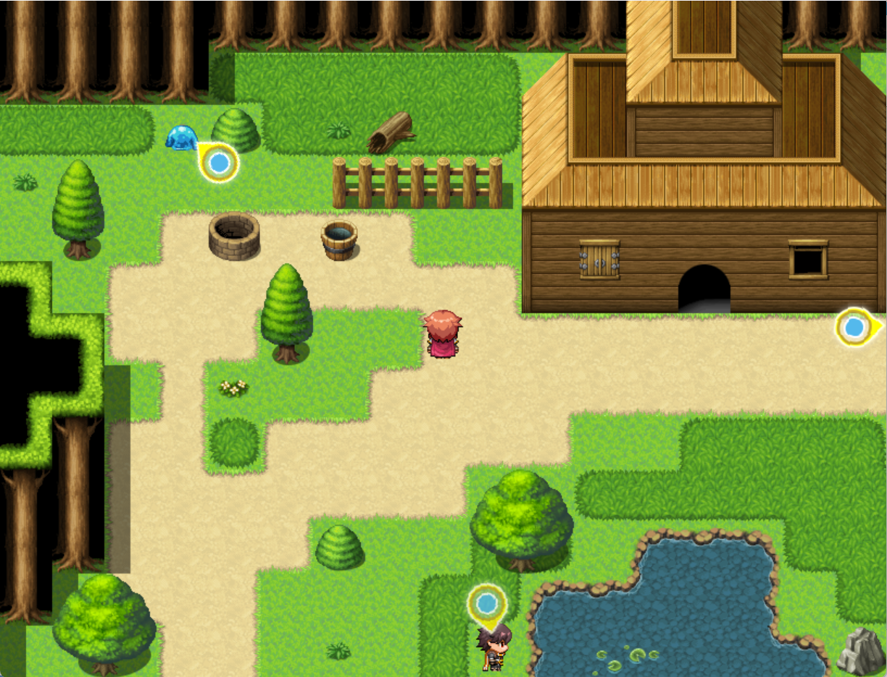
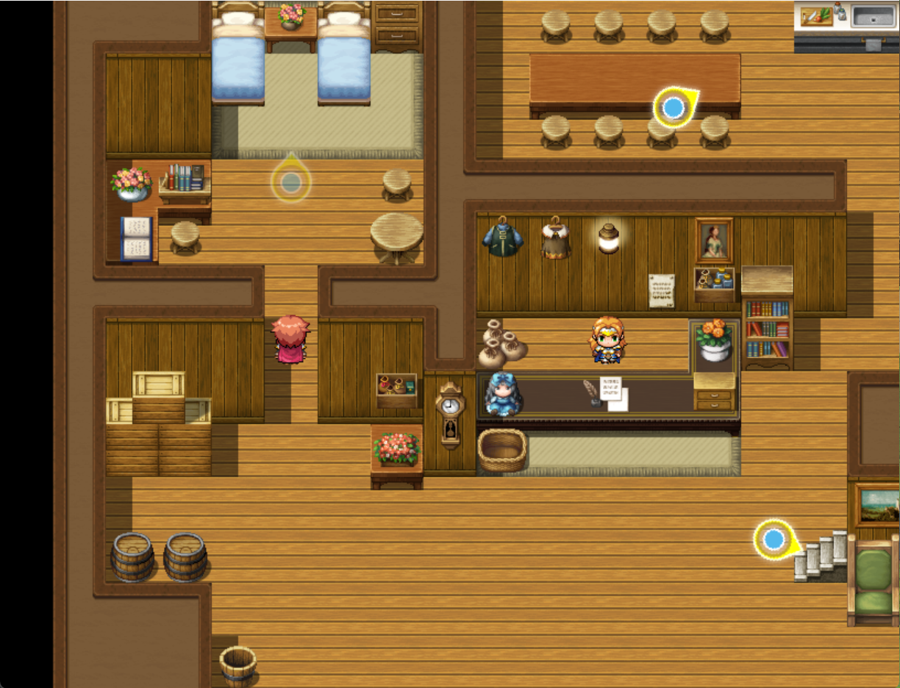
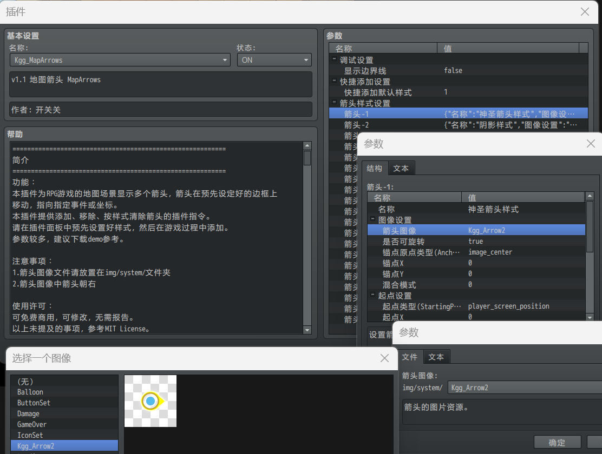

# 【RMMV插件】地图箭头MapArrows 指向目标位置/事件

[【Project1】](https://rpg.blue/thread-494806-1-1.html "进入Project1论坛的本插件的发布页")

## 应用场景

　　当你画了一幅宏伟震撼的地图，玩家在其中迷路，叫苦不迭；

　　当你的NPC随机移动，玩家想找他对话却找不到当前位置，无所适从；

　　当你要给玩家一点奖励，想让玩家发现路边的宝箱，宝箱却不好意思主动蹦出来；

　　当你的剧情被好久没玩的玩家暂时遗忘，玩家久违进入游戏却不知道下一步应该往哪个方向走；

　　当你的主角被危难几乎摧毁了心智，斗志处于最低谷的时刻，你想要给予他来自上苍的 **神圣的指引** ......

　　你，可以解除他们的疑惑和苦闷；

　　你，可以指引他们在喜悦中知晓前进的方向；

　　你，可以成为你笔下主角走出迷茫后永远忘不掉的那一抹圣光！

　　只要使用这个插件，施予你的 **箭头** ！

## 功能

　　本插件为 RPG Maker MV 游戏项目的地图场景边缘显示一个或多个箭头作为GUI，箭头在预先设定好的边框上移动，指向地图上指定的事件或位置。

　　本插件提供添加、移除、按样式清除箭头的插件指令。插件指令的风格仿照了Drill_up系列插件，学习成本低。

　　每种样式的箭头可以自定图像；可自定边框位置，有矩形和椭圆可选。可叠加显示多个不同箭头。

　　请在插件面板中预先设置好样式，然后在游戏过程中添加箭头。

　　参数较多，建议下载demo参考。

## 下载

　　在 [releases](https://github.com/KggFromChina/Kgg_MapArrows_Demo/releases) 中下载最新版本的压缩包。名称含有“full”的压缩包是完整工程，解压即用；不含“full”的需要覆盖到新工程。

　　Demo使用方法：

　　下载 Kgg_MapArrows_Demo_vX.X_full.zip ，解压，然后用 RMMV 打开 Game.rpgproject 。

　　或者下载 Kgg_MapArrows_Demo_vX.X.zip （X是任意数字），新建工程，将下载的压缩包内的文件复制到工程中进行替换。选择替换覆盖选项时，对文件夹进行“合并”而不是“替换”，对同名文件选择“跳过”，避免覆盖下载的文件，然后用 RMMV 打开 Game.rpgproject 。

　　要将插件用于您的 RPG Maker MV 游戏项目，请将 demo/js/plugins/Kgg_MapArrows.js 复制到您的工程的 js/plugins/ 文件夹中，然后在 RPG Maker MV 编辑器的插件管理器中添加该插件。

　　插件本身仅有 Kgg_MapArrows.js 一个文件，附带 Kgg_Arrow2.png 。

## 注意事项

　　1.箭头图像文件请放置在 img/system/ 文件夹

　　2.箭头图像中箭头朝右

　　3.支持使用 Drill_up 的插件最大值编辑器（DrillLengthEditor）修改箭头样式数量的最大值。获取链接：[drill插件集合](https://rpg.blue/thread-409713-1-1.html)

## 使用许可

- Kgg_MapArrows.js

　　可免费商用，可修改，无需报告。

　　以上未提及的事项，参考MIT License。

- Kgg_Arrow2.png

　　原创素材，可免费商用，可修改，无需报告。

## 感谢

　　此插件是拜读Drill_up的插件教程写出来的，感谢Drill_up大佬！

　　感谢honmarei指出问题。

## 截图

